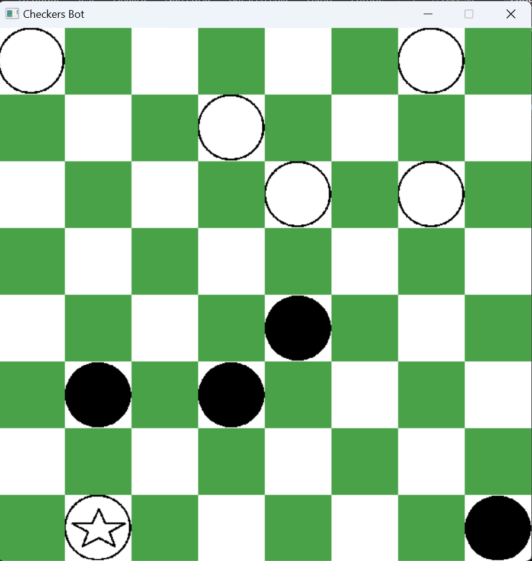

# Checkers bot #

A checkers bot implemented using Monte-Carlo Tree search algorithm. 

## Monte-Carlo Tree Search (MCTS) ##

MCTS is an algorithm that is used to find the beast possible move in current position. MCTS consist of 3 steps that are applied sequential.

- Selection: 
    - Starting from root (current position) select a child node until a leaf is reached.
- Expansion:
    - If the position is not terminal create one or more child nodes (available positions) and choose one or more from them.
- Simulation:
    - After choosing a node playout the game with random moves until reaching a terminal position.
- Backpropagation:
    - After the simulation is finished we update the win/draw/lose stats of each node that lies on the path from root to selected node.

The nodes are selected using Upper Confidence Bound (UCT): 

$$
\frac{w_i}{n_i} + c\sqrt{\frac{\ln N_i}{n_i}}$$ 

Where:
- $w_i$ is the number of wins for the node after the i-th move.
- $n_i$ is the number of simulation completed for the node after the i-th move
- $N_i$ is the total number of simulation after the i-th move
- $c$ is the exploration parameter in our case is equal to $\sqrt{2}$

We evaluate every node using this formula and select the node with the highest evaluation value.

The algorithm was implemented in two formats:
- Sequentialy - using only CPU
- Parallel - using GPU and CUDA technology

## Parallel implementation ##
The gpu implementation modifies the expansion and simulation steps. Instead of selecting one child we select all of them. Then for each one we run a block of 768 threads which each exectutes the simulation step independently. We then accumulate the results and backpropagate them.

